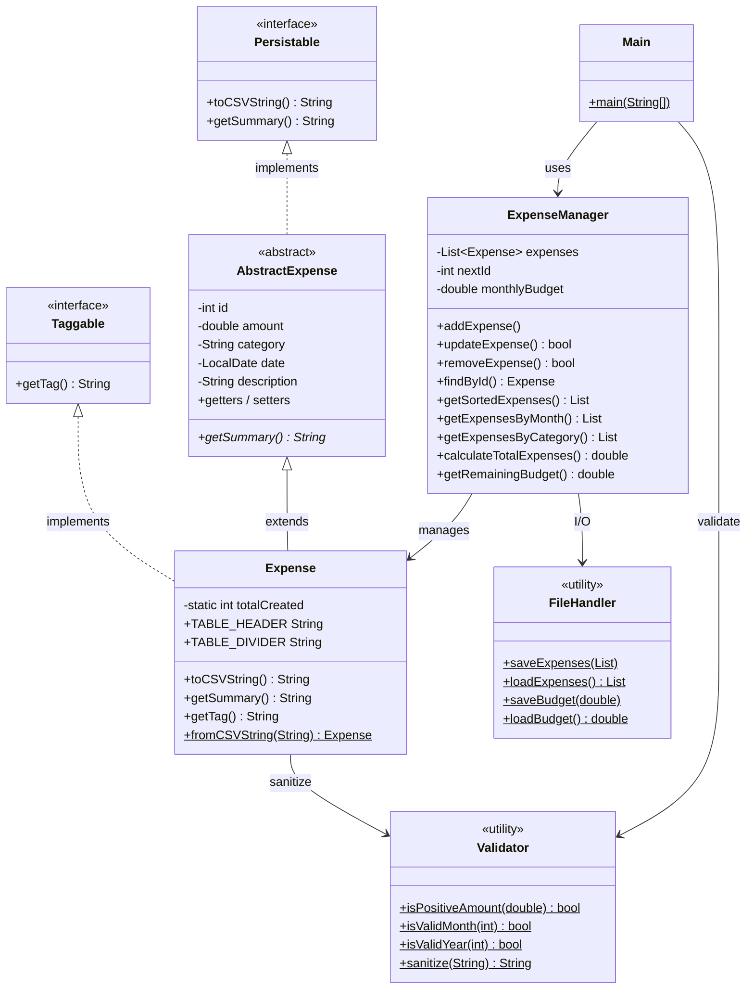
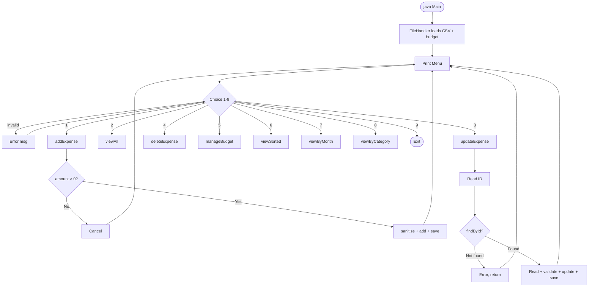

# Java Expense Tracker CLI

> **Paise ped pe nhi ugte** — A lightweight, persistent CLI expense tracker built with Java.

---

## Features

| Feature | Details |
|---|---|
| Full CRUD | Add, View, Update, and Delete expenses |
| Persistent Storage | Saved to `expenses.csv` and `budget.txt` |
| Monthly Budgeting | Set a budget and get over-limit warnings |
| Filtering | Filter by month/year or category |
| Sorting | Sort by Date or Amount |
| INR Formatting | Amounts shown as `INR 1,234.00` |
| Input Validation | Rejects negatives, bad months, empty fields, unknown IDs |
| Table Display | Header row + divider — no repeated labels per row |

---

## OOP Concepts Implemented

### Inheritance Types

#### 1. Single Inheritance
`Expense` has exactly one parent class:
```
AbstractExpense  <--  Expense
```

#### 2. Multiple Inheritance (via interfaces — Java's only way)
`Expense` satisfies **two interfaces simultaneously**:
- `Persistable` — inherited automatically through `AbstractExpense`
- `Taggable` — implemented directly on `Expense`

```
Persistable (interface)     Taggable (interface)
        |                        |
AbstractExpense (abstract)        |
        |                        |
        +------------------------+
                    |
                Expense   <-- implements BOTH at once
```

This is Java's multiple inheritance: a class can extend only one parent but implement any number of interfaces.

### Class Diagram



### Application Flow



### Other OOP Concepts

| Concept | Where |
|---|---|
| **Encapsulation** | All fields `private`, access via getters/setters |
| **Polymorphism** | `displayList()` calls `e.getSummary()` — works on any `AbstractExpense` subtype |
| **`finally` block** | `FileHandler.loadExpenses()` — guarantees reader closes on exception |
| **`static` members** | `FileHandler` (all methods), `Expense.totalCreated`, `Main.manager/scanner` |
| **Access modifiers** | `private` fields, `private` constructor (`FileHandler`, `Validator`), `private save()` |
| **`final` fields** | `ExpenseManager.expenses`, `Main.manager`, `Main.scanner` |

---

## Architecture

```
Persistable (interface)   +   Taggable (interface)
                          |
              AbstractExpense  (abstract class)
                          |
                      Expense  (concrete model)

FileHandler    (static utility — file I/O)
ExpenseManager (service  — business logic)
Validator      (static utility — input validation)
Main           (UI layer — CLI menu)
```

---

## Prerequisites

- Java Development Kit (JDK) **8 or higher**
- Git

---

## Installation & Running

```bash
# 1. Clone
git clone https://github.com/harsh-aghara/java-mini-project.git
cd java-mini-project

# 2. Compile
javac *.java

# 3. Run
java Main
```

---

## Usage

| Option | Action |
|---|---|
| `1` | Add expense (amount, category, description) |
| `2` | View all expenses in table format |
| `3` | Update an expense by ID (ID validated before asking other fields) |
| `4` | Delete an expense by ID |
| `5` | View/Set monthly budget |
| `6` | View sorted (by Date or Amount) |
| `7` | Filter by month (1–12) and year (1900–2100) |
| `8` | Filter by category |
| `9` | Exit |

---

## Tests

A self-contained test suite (`tests/RunTests.java`) covers ~150 cases. No JUnit needed.

```bash
javac *.java tests/RunTests.java
java -cp "tests;." RunTests        # Windows
java -cp "tests:." RunTests        # Linux / macOS
```

**Sections:**

| Section | Cases | What is tested |
|---|---|---|
| A — Validator | 40 | Amount, budget, month, year, sanitize, non-empty |
| B — Expense model | 37 | Getters, setters, CSV, round-trip, display, header/divider |
| C — CRUD | 19 | Add, find, update, sanitize-on-update, remove, defensive copy |
| D — Queries | 16 | Sort, month filter, category filter, totals |
| E — Budget | 5 | Persistence, remaining, over-budget |
| F — Round-trips | 7 | Add/reload, update/reload, delete/reload |
| G — Edge cases | 13 | Tiny/huge amounts, special chars, long strings, whitespace |

---

## Project Structure

```
.
├── Persistable.java      # Interface 1 — toCSVString(), getSummary()
├── Taggable.java         # Interface 2 — getTag()
├── AbstractExpense.java  # Abstract base — common fields, implements Persistable
├── Expense.java          # Concrete model — extends AbstractExpense implements Taggable
├── ExpenseManager.java   # Service layer — business logic
├── FileHandler.java      # Data access — CSV and budget file I/O
├── Validator.java        # Utility — input validation
├── Main.java             # UI layer — CLI menu
├── tests/
│   └── RunTests.java     # ~150 test cases, no JUnit required
├── README.md
└── .gitignore
```

---

Created by [harsh-aghara](https://github.com/harsh-aghara)  
OOP enhancements contributed by [Harkeerat Singh](https://github.com/Harkeerat24)
